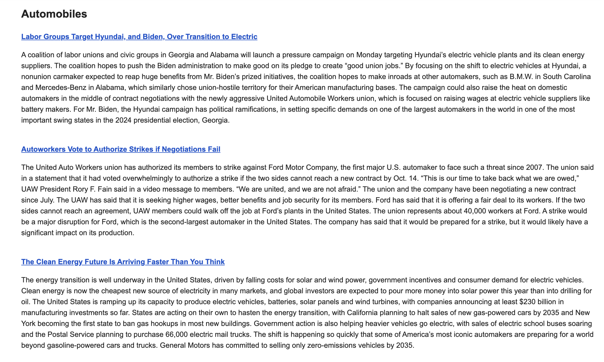

# YourDailyRundown Backend

This project automates the process of delivering personalized daily newsletters to subscribers. It involves two main scripts: `main.py` and `news_summarizer.py`. Additionally, the project is scheduled to run every day at 8 am CST using PythonAnywhere's scheduled task feature.

[Frontend Repo](https://github.com/GiridharRNair/YourDailyRundown)

Example email of automobile category:

## `main.py`

This script serves as a Flask application that handles user registration, subscription preferences, and sending greeting and unsubscribe emails. It also provides routes to retrieve registered users and to unsubscribe users.

### Endpoints

- `POST /register_user`: Registers a new user with their first name, last name, email, and subscription categories. Sends a greeting email to the user.
- `GET /registered_users`: Retrieves a list of all registered users from the database.
- `GET /<email>/unsubscribe`: Unsubscribes a user from the newsletter and renders the unsubscribe page.

## `news_summarizer.py`

This script performs the following tasks:

1. Fetches top headlines for various news categories from the New York Times API.
2. Summarizes the content of fetched news articles using the PALM text generation API.
3. Retrieves a list of subscribers from the database using the `get_users()` function from `main.py`.
4. Generates personalized newsletters for each subscriber based on their subscription preferences and the summarized articles.

The script uses the following APIs and libraries:

- The New York Times API: Fetches top news articles for various categories.
- The PALM text generation API: Summarizes article content.
- The `sendgrid` library: Sends personalized newsletters to subscribers.
- The `newsplease` library: Extracts article details from article URLs.

## How It Works

1. `main.py`:
   - Users can register via the `/register_user` endpoint, providing their details and subscription preferences.
   - User information is stored in an SQLite database.
   - Greeting emails are sent to users upon successful registration.

2. `news_summarizer.py`:
   - The script fetches top headlines for various news categories from the New York Times API.
   - For each article, it extracts details and content using the `newsplease` library.
   - The content is summarized using the PALM text generation API.
   - Personalized newsletters are generated for each subscriber based on their subscription preferences and the summarized articles.
   - The newsletters are sent using the `sendgrid` library.

3. Daily Automation:
   - The `news_summarizer.py` script is scheduled to run daily at 8 am CST using PythonAnywhere's scheduled task feature.
   - It fetches, summarizes, and sends personalized newsletters to subscribers.

## Configuration

To set up the project, make sure to:

- Configure environment variables in the `.env` file:
   - `AI_API_KEY`: PALM text generation API key.
   - `SENDGRID_API_KEY`: SendGrid API key.
   - `NYT_API_KEY`: New York Times API key.
- Install required libraries using `pip`:
