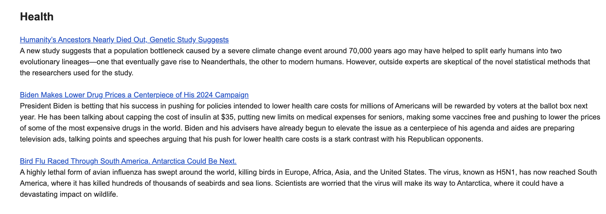

# YourDailyRundown Backend

Welcome to the YourDailyRundown Backend repository! This backend serves as the core of YourDailyRundown, an email service designed to summarize news articles and deliver them to users. In this README, we'll provide an overview of the project, its architecture, components, environment variables, and licensing information.

## Overview

YourDailyRundown is a service that simplifies the consumption of news articles. It aggregates news articles from various categories and delivers summarized versions to users via email. The backend handles critical tasks such as user registration and validation, article summarization using Google's PaLM AI model, and email distribution. News articles are sourced from the New York Times API and extracted using [News-Please](https://github.com/fhamborg/news-please).

Frontend Repo: https://github.com/GiridharRNair/YourDailyRundown  
Live Demo: https://giridharrnair.github.io/YourDailyRundown/

**Example email of the health category**:

## Architecture

The backend of YourDailyRundown is a Python-based application built using the Flask web framework. It is responsible for the following main functionalities:

1. **User Registration**: Users can register with their first name, last name, email, and select news categories they are interested in. This information is stored in a MongoDB database after user validation.

2. **Email Delivery**: Summarized news articles are sent to users via email on a daily schedule at 8 AM CST (13:00 UTC).

3. **News Article Summarization**: The backend retrieves top headlines from the New York Times API for various categories and summarizes these articles using a Google's PaLM AI.

4. **Unsubscribe**: Users can unsubscribe from the service by clicking an unsubscribe link in the email. Their information is then removed from the database.

## Components

### `main.py`
`main.py` is the main Flask application responsible for handling user registration, validation, and unsubscription. It utilizes Flask to create API endpoints and interacts with a MongoDB database to store user information. Here's an overview of its API endpoints:

* `/register_user`: Registers a new user based on JSON data, inserts their information into a MongoDB database, and sends an email for email validation.

* `/update_user_preferences`: Allows existing users to update their preferences using JSON data, updating their information in the database and sending a confirmation email.

* `/<uuid>/get_user_categories`: Retrieves user information, including first name, last name, and categories, for a validated user based on their UUID.

* `/<uuid>/validate`: Validates a user's email address, updates their validation status, sends a welcome email, and renders a validation success confirmation page.

* `/unsubscribe`: Unsubscribes users from email notifications, sends their feedback to the developer, and confirms the unsubscription via email.

### `news_summarizer.py`
`news_summarizer.py` is responsible for summarizing, using Google's PaLM AI, news articles from various categories sourced from the New York Times API, scraped using [News-Please](https://github.com/fhamborg/news-please).

### `email_subscribers.py`
`email_subscribers.py` sends the summarized news articles from `news_summarizer.py` to subscribers via email. It retrieves the list of validated subscribers from the MongoDB collection and builds the email content with summarized news articles for the specified categories.

## YAML Files

### `main_yourdailyrundown.yaml`
This YAML file defines a GitHub Actions workflow for building and deploying the Python application to Azure Web App.

### `daily_email_distribution.yaml`
This YAML file defines a GitHub Actions workflow for running the daily_email_distribution.py script on a schedule, daily at 8:00 AM CST (13:00 UTC).

## Environment Variables
To run the YourDailyRundown Backend, you'll need to set the following environment variables:

`AI_API_KEY`= Your Google PaLM AI API Key.

`SENDGRID_API_KEY`=Your SendGrid API Key for Email Distribution.

`NYT_API_KEY`=The New York Times API Key.

`MONGO_URI`=MongoDB Connection String.

`DEV_EMAIL`=My Personal Email Address to Receive Feedback From Users

## License
This project is licensed under the MIT License. Feel free to contribute to this project by opening issues or pull requests.